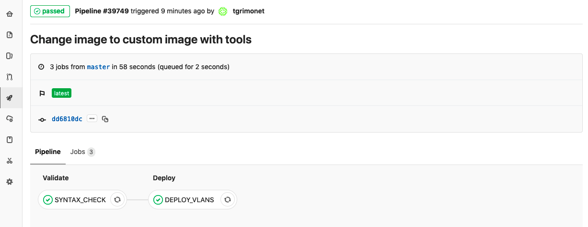
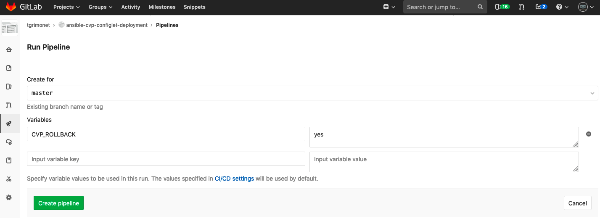

<!-- START doctoc generated TOC please keep comment here to allow auto update -->
<!-- DON'T EDIT THIS SECTION, INSTEAD RE-RUN doctoc TO UPDATE -->


- [Demo to build config with Ansible and deploy with CVP](#demo-to-build-config-with-ansible-and-deploy-with-cvp)
    - [Install requirements](#install-requirements)
    - [Demo step by step](#demo-step-by-step)
        - [Configure your environment](#configure-your-environment)
        - [Edit data](#edit-data)
        - [Build phase](#build-phase)
        - [Deploy Configlet and change-control](#deploy-configlet-and-change-control)
        - [Check Result](#check-result)
        - [(Optional) Rollback changes](#optional-rollback-changes)
    - [Demo with Continuous Integration](#demo-with-continuous-integration)
        - [Execute Change with CI/CD](#execute-change-with-cicd)
        - [Cleanup demo environment](#cleanup-demo-environment)
    - [License](#license)
    - [Ask question or report issue](#ask-question-or-report-issue)
    - [Contribute](#contribute)

<!-- END doctoc generated TOC please keep comment here to allow auto update -->

# Demo to build config with Ansible and deploy with CVP

This content demonstrate how to use ansible to build configlet for devices and CVP to deploy changes with control and visibility. A powerpoint with a step by step is available on [drive](https://docs.google.com/presentation/d/1R3vcBFbUpEl2sIABgNjPNTWNXU1tCkxv6rLzg84nDIo/edit?usp=sharing)


This demo has been built using these requirements:

- [Ansible framework](https://docs.ansible.com) for template management.
- [CVP Configlet Uploader](https://github.com/titom73/configlet-cvp-uploader) to deploy configlet on CVP.
- Arista Demo Cloud ATD to provide Cloudvision server and EOS endpoints.

> In this demo, __Ansible__ only provides a basic jinja2 rendering with one group and very basic content. So you can basically change __ansible__ content by any tools / __python__ scripts to generate your content as long as output is similar to what we describe below.

Ansible content will do 3 different tasks:
- Create configlet with vlans to configure.
- Create a `JSON` file to deploy this configlet (assuming it is a new configlet).
- Create a `JSON` file to manage manual rollback after the demo.

Once Ansible has generated content, [`cvp-configlet-uploader`](https://github.com/titom73/configlet-cvp-uploader) has to be use to deploy `configlet` and create a `change-control`

## Install requirements

To use this demo, you have to install requirements with following commands:

```shell
# Ansible librairies
$ pip install -r requirements.txt

# cvprac and cvp-configlet-uploader
## cvprac@develop is required as CVP change-control API updates is not in master.
## Once it will be merged, command will no longer be required
$ pip install git+https://github.com/aristanetworks/cvprac.git@develop

# Python script to upload configlet & create change-control
$ pip install git+https://github.com/titom73/configlet-cvp-uploader.git
```

> In the meantime, you have to build your own topology with a CVP server or rely on an Test Drive. 
> As everything is based on ATD, it is recommended to use an intstance as everything has been packaged such as device name, groups, and content


## Demo step by step

This demo will create a list of vlans on a set of leaf devices.

### Configure your environment

it is required to configure some variables first to create connection to CVP server. All these elements are configured in file [env.settings](env.settings)

__Mandatory fields:__
- `CVP_HOST`: IP address of your CloudVision server. Should be updated to match your environment or your ATD server
- `CVP_PORT`: CVP Port (set to 443). If using ATD or default setup, this value should not have to be updated
- `CVP_PROTO`: HTTP or HTTPS (set to https). If using ATD or default setup, this value should not have to be updated
- `CVP_USER`: Your CVP username. If using ATD, this value should not have to be updated
- `CVP_PASS`: Your CVP password. If using ATD, this value should not have to be updated

__Optional Field:__
- `CVP_CC_APPLY`: (Optional ) if set to true, change-control will be scheduling to be executed 3 minutes after its creation
- `CVP_CC_TZ`: (optional) Timezone to schedule change-control. 
- `CVP_CC_COUNTRY`: (optional) Country code to use in change-control scheduling

Once you have updated this file, just run following command:

```shell
$ source env.settings
CVP Uploader configured with
 - server: 13.56.254.40
 - username: arista
```

### Edit data

Information about vlans and devices to use for deployment is defined in [group_vars/leaf](group_vars/leaf) folder. 

Data structure we use to define vlans is the following:

```yaml
---
  customers:
    devices:            # List of devices where to deploy configlet
      - 'leaf1'
      - 'leaf2'
      - 'leaf3'
    dict:               # List of customers
      cust01:           # Customer name
        vlans:          # List of vlan-ids configured for customer
          - 10
          - 11
          - 12
          - 13
```

> You can use vlans already configured or change them to match your demo.

### Build phase 

Build phase is a basic ansible playbook to run:

```shell
ansible-playbook playbook.build.customers.vlans.yml -i inventory.ini

PLAY [Build] ********************************************************************

TASK [remove host build temp directory] *****************************************
changed: [leaf1 -> localhost]

TASK [create host build temp directory] *****************************************
changed: [leaf1 -> localhost]

PLAY [Build Configlets] *********************************************************

TASK [configlet.customers.vlans : Generate Configlet for customers VLANs.] ******
changed: [leaf1]

TASK [configlet.customers.vlans : Build JSON to deploy configlet] ***************
changed: [leaf1]

TASK [configlet.customers.vlans : Build JSON to rollback configlet] *************
changed: [leaf1]

PLAY RECAP **********************************************************************
leaf1                      : ok=5    changed=5    unreachable=0    failed=0
```

You can check result in [configlets](configlets/) folder:

```
$ tree -L 2
.
├── README.md
├── configlets
│   ├── configlet.customers.vlans.conf
│   ├── customers.vlans.actions.json
│   └── rollback.customers.vlans.actions.json
├── env.settings
```

### Deploy Configlet and change-control

Once content has been created, you can use cvp-configlet-uploader to deploy content to CloudVision:

```shell
$ cvp-configlet-uploader -j configlets/customers.vlans.actions.json   

--------------------

2019-04-08 13:01:16 INFO     configlet Customers VLANs configlet is going to be\
  created configlets/configlet.customers.vlans.conf
2019-04-08 13:01:17 INFO     Connected to 13.56.254.40
2019-04-08 13:01:17 INFO     *************
2019-04-08 13:01:17 INFO     Start working with configlets/configlet.customers.vlans.conf
2019-04-08 13:01:17 ERROR    GET: https://13.56.254.40:443/web/configlet/\
    getConfigletByName.do?name=configlet.customers.\
    vlans.conf : Request Error: Entity does not exist
2019-04-08 13:01:17 WARNING  Configlet NOT found on 13.56.254.40
2019-04-08 13:01:17 INFO     Start to create new configlet: \
    configlets/configlet.customers.vlans.conf
2019-04-08 13:01:17 INFO     Version [u'2018', u'2', u'2']
2019-04-08 13:01:17 INFO     Setting API version to v2
2019-04-08 13:01:19 INFO     Create configlet configlet.customers.vlans.conf
2019-04-08 13:01:19 INFO     Apply configlet configlet.customers.vlans.conf to leaf1
2019-04-08 13:01:20 INFO     Apply configlet configlet.customers.vlans.conf to leaf2
2019-04-08 13:01:21 INFO     Apply configlet configlet.customers.vlans.conf to leaf3
2019-04-08 13:01:22 INFO     Configlet configlet.customers.vlans.conf\
     has been applied to all devices
2019-04-08 13:01:22 WARNING  deploy option has not been set for the configlet
2019-04-08 13:01:22 WARNING  --> doing nothing

--------------------

2019-04-08 13:01:22 INFO     Wait 10 sec before next action
2019-04-08 13:01:32 INFO     Implementation in progress -- expect some issues
2019-04-08 13:01:33 INFO     Connected to 13.56.254.40
2019-04-08 13:01:33 INFO     start change-control creation
2019-04-08 13:01:33 INFO     change control must be executed manually
2019-04-08 13:01:33 INFO     Building a dictionary of changes
2019-04-08 13:01:33 INFO     !CVP informs us that change-control creation is success (id 23)
2019-04-08 13:01:33 INFO     Wait 10 sec before next action

```

This command will do following actions:
- Deploy configlet from `configlets/configlet.customers.vlans.conf` to CloudVision server
- Attach this configlet to devices listed in __[group_vars/leaf/vlan_customers.yaml](group_vars/leaf/vlan_customers.yaml)__ if they are configured on CVP
- Create tasks on CVP for configlet deployment
- Create a change control for all these tasks with a pre/post snapshot (Default snapshot defined in ATD)

> By default this command do not execute any change-control nor schedule change-control.

### Check Result

After CVP deployment, you can connect to your CVP server to get result

- __Configlet__: `https://${{CVP_HOST}}/web/#/configlet`
- __Tasks__: `https://${{CVP_HOST}}/web/#/task`
- __Change Control__: `https://${{CVP_HOST}}/web/#/changecontrol`

And finally, execute change-control manually


### (Optional) Rollback changes

Ansible generate a file to create a rollback to instruct CVP to delete configlet and create a change control to remove this configlet output from devices.

Just use following command:

```
$ cvp-configlet-uploader -j configlets/rollback.customers.vlans.actions.json
```

## Demo with Continuous Integration

Demo can be run with a CI/CD approach with no action from local laptop using any runners like gitlab-runners, travisci or Jenkins.

In this repository, we will provide configuration for gitlab-runners but it can be replicated on any 3rd CI tool.

### Execute Change with CI/CD

1. Fork the repository in your namespace
2. Go to __settings/ci_cd__ in your project and configure __Environment Variables__:
  
  __Mandatory Entries__
  - __CVP_HOST__= *< YOUR CVP IP Address >*
  - __CVP_PORT__ = *443*
  - __CVP_PROTO__ = *https*
  - __CVP_USER__ = *arista*
  - __CVP_PASS__ = *arista*

  __Optional Entries__
  - __CVP_CC_APPLY__= *true*
  - __CVP_CC_TZ__= *Etc/UTC* (or any other suitable timezone)
  - __CVP_CC_COUNTRY__= *UK* (or any other country code that suit you)

> Note: Arista runners are configured using ETC/UTC timezone. So it is not recommended to change this setting unless you know how to fix potential issue.


3. Create and run a pipeline under __pipelines__


Then you can monitor workflow execution. This workflow is a multi-stage approach with following stages:

- Validation: Just check ansible code to be sure there is no typo
- Deploy: Execute Ansible and Python to deploy configlet.



4. If all tasks are green, you can connect to CVP and check your change control


> Note: if you scheduled change-control execution, just wait 3 minutes and you will get a completed change-control

5. Check changes after execution

> If you did not schedule the change-control, first run this action.

Like any other change-control, you can compare result of your snapshot and see if change is coherent or break your network


### Cleanup demo environment

A stage is available in CI/CD workflow to manage configuration rollback and to remove configlet from server.
To run this task, start a new pipeline with following varirable:

- `CVP_ROLLBACK`=*yes*



By default, this task is scheduled to be executed 3 minutes after you deploy this change. Hence, it is just a click and forget approach.

## License

Project is published under [BSD License](LICENSE).

## Ask question or report issue

Please open an issue on Github this is the fastest way to get an answer.

## Contribute

Contributing pull requests are gladly welcomed for this repository. If you are planning a big change, please start a discussion first to make sure we’ll be able to merge it.